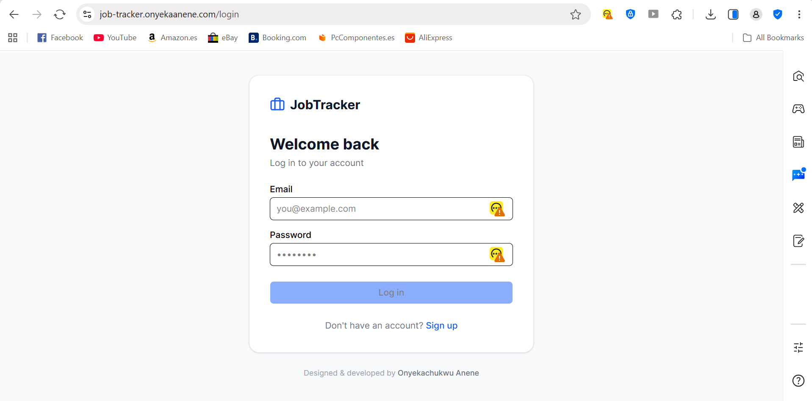
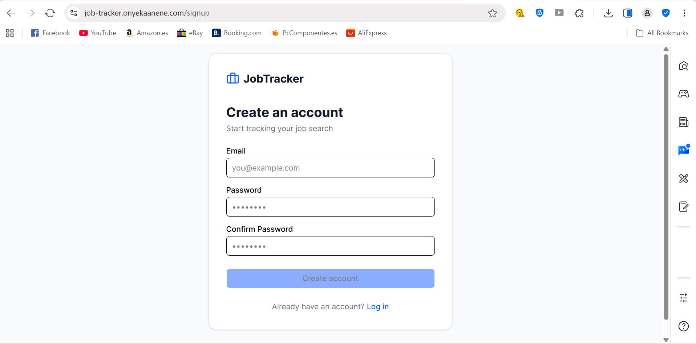
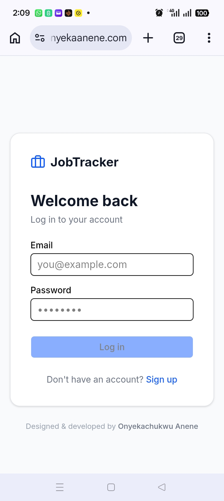
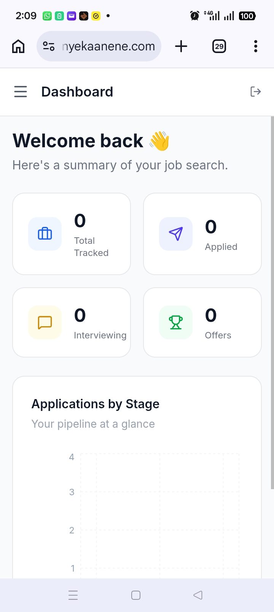

# 🎯 JobTracker — Job Application Tracking App

> A full-stack productivity app that helps job seekers organise, track, and manage their job applications — built because I needed it during my own job search.

**🔗 Live Link:** [job-tracker.onyekaanene.com](https://job-tracker.onyekaanene.com) &nbsp;|&nbsp; **📂 Repo:** [github.com/onyekaanene/job-tracker](https://github.com/onyekaanene/job-tracker)

---

## 🚀 Why I Built This

While actively job hunting as a Software Engineer, I found myself losing track of applications across spreadsheets, browser tabs, and sticky notes. I built JobTracker to solve that — a clean, fast, real-world app I actually use every day.

This project also gave me the opportunity to work with a modern full-stack architecture from scratch: **Next.js 14 App Router, TypeScript, Supabase Auth + PostgreSQL, and Zustand** — the kind of stack startups are shipping with right now.

---

## ✨ Features

| Feature | Description |
|---|---|
| 🔐 Authentication | Secure sign up / login via Supabase Auth |
| 🗂️ Kanban Board | Drag-and-drop applications across 5 stages |
| 📊 Dashboard | Live stats cards + bar chart of your pipeline |
| 💾 Persistent Storage | All data saved to PostgreSQL — survives refresh |
| 📱 Responsive Design | Fully usable on mobile, tablet, and desktop |
| 🔒 Row Level Security | Each user can only see and edit their own data |
| ⚡ Optimistic UI | State updates instantly — no waiting for the server |

---

## 📸 Screenshots

### Desktop




### Mobile



---

## 🎬 App Walkthrough

### Dashboard — Your pipeline at a glance
Track total applications, active interviews, and offers with live stats that update as you move cards.

### Kanban Board — Drag and drop
Five columns: **Wishlist → Applied → Interview → Offer → Rejected**. Drag any card to update its status — changes are saved to the database in real time.

### Add Application Modal
Log a new job in seconds — company, role, salary, location, job URL, and notes all in one place.

### Auth Flow
Secure email/password authentication with protected routes. Unauthenticated users are automatically redirected to login.

---

## 🛠️ Tech Stack

```
Frontend       Next.js 14 (App Router) + TypeScript
Styling        Tailwind CSS + shadcn/ui
State          Zustand
Auth           Supabase Auth
Database       Supabase (PostgreSQL) with Row Level Security
Charts         Recharts
Drag & Drop    @hello-pangea/dnd
Deployment     Vercel
```

### Architecture Decisions

- **Next.js App Router** — chosen for its server component model, file-based routing, and built-in layout system. Layouts like the sidebar and navbar render once and persist across page navigations.
- **Supabase** — provides both auth and a PostgreSQL database in one platform. Row Level Security policies are defined at the database level, not just the application layer.
- **Zustand over Redux** — lightweight global state without boilerplate. Store actions map 1:1 to database operations, keeping the data layer predictable.
- **Optimistic updates** — UI state updates immediately on user action while the async database call runs in the background, making the app feel instant.

---

## 📁 Project Structure

```
job-tracker/
├── app/                        # Next.js App Router
│   ├── dashboard/page.tsx      # Stats + charts
│   ├── applications/page.tsx   # Kanban board
│   ├── settings/page.tsx       # Account settings
│   ├── login/page.tsx          # Login page
│   └── signup/page.tsx         # Signup page
│
├── components/
│   ├── dashboard/              # StatsCards, Chart, RecentList
│   ├── kanban/                 # Board, Column, JobCard, Modal
│   ├── layout/                 # Sidebar, Navbar, AppLayout
│   ├── settings/               # SettingsForm
│   └── ui/                     # shadcn/ui base components
│
├── lib/
│   ├── supabase/               # Browser + server Supabase clients
│   └── applications.ts         # All database query functions
│
├── store/
│   └── useApplicationStore.ts  # Zustand store + actions
│
├── types/
│   └── index.ts                # Shared TypeScript types
│
└── proxy.ts                    # Auth route protection
```

---

## 🏃 Running Locally

### Prerequisites
- Node.js 18+
- A free [Supabase](https://supabase.com) account

### 1. Clone the repo
```bash
git clone https://github.com/onyekaanene/job-tracker.git
cd job-tracker
npm install
```

### 2. Set up environment variables
Create a `.env.local` file in the root:
```
NEXT_PUBLIC_SUPABASE_URL=your_supabase_project_url
NEXT_PUBLIC_SUPABASE_PUBLISHABLE_KEY=your_supabase_publishable_key
```

### 3. Set up the database
Run the following SQL in your Supabase SQL editor:

```sql
create table applications (
  id uuid default gen_random_uuid() primary key,
  user_id uuid references auth.users(id) on delete cascade not null,
  company_name text not null,
  role text not null,
  status text not null default 'applied',
  applied_date text,
  job_url text,
  salary text,
  location text,
  notes text,
  created_at timestamp with time zone default now()
);

alter table applications enable row level security;

create policy "Users can view own applications" on applications
  for select using (auth.uid() = user_id);

create policy "Users can insert own applications" on applications
  for insert with check (auth.uid() = user_id);

create policy "Users can update own applications" on applications
  for update using (auth.uid() = user_id);

create policy "Users can delete own applications" on applications
  for delete using (auth.uid() = user_id);
```

### 4. Run the app
```bash
npm run dev
```
Open [http://localhost:3000](http://localhost:3000)

---

## 🚢 Deployment

The app is deployed on **Vercel** with environment variables configured in the Vercel dashboard. Supabase URL Configuration is updated to allow auth redirects from the production domain.

---

## 🗺️ Roadmap

- [ ] Google OAuth login
- [ ] CSV export of all applications
- [ ] Follow-up reminders and deadline alerts
- [ ] Notes and activity timeline per application
- [ ] React Native mobile companion app

---

## 👨‍💻 Author

**Onyekachukwu Anene** — Software Engineer (Frontend - React/Next.js, React Native)

[](https://github.com/onyekaanene)
[](https://www.linkedin.com/in/onyekachukwu-anene)
[](https://github.com/onyekaanene)

---

## 📄 License

MIT — feel free to fork, use, and build on this.
