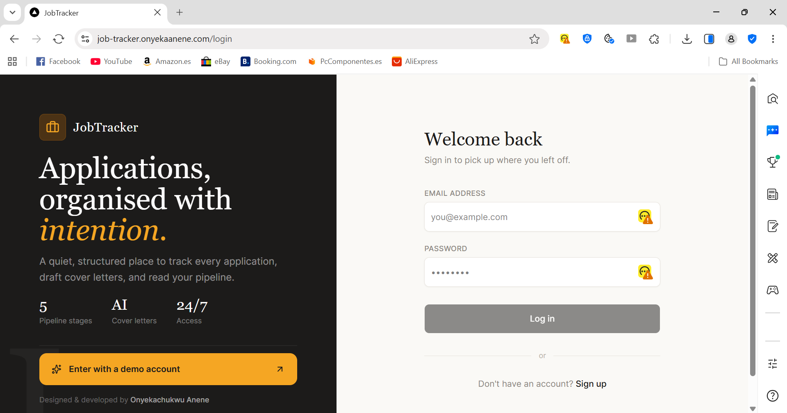
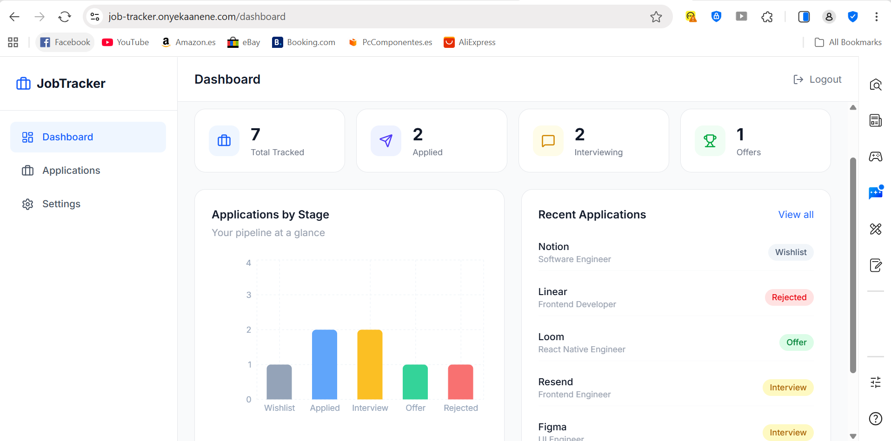
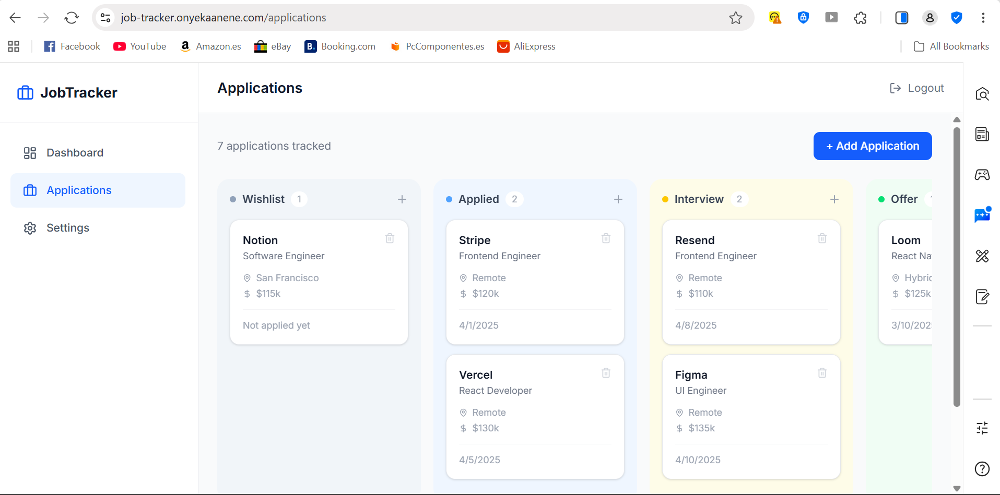
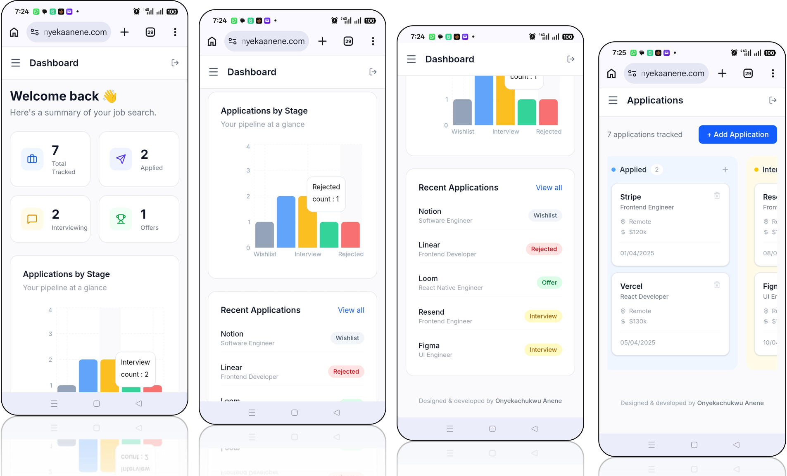

# 🎯 Job Tracker — AI-Powered Job Application Tracking App

> Job Tracker is a full-stack productivity app that helps job seekers organise, track, and manage their job applications — built because I needed it during my own job search. Powered by Claude AI.


**🔗 Live Link Demo:** [job-tracker.onyekaanene.com](https://job-tracker.onyekaanene.com) &nbsp;|&nbsp; **📂 Repo:** [github.com/onyekaanene/job-tracker](https://github.com/onyekaanene/job-tracker)  &nbsp;|&nbsp; **📧 Email: Questions, Comments & Suggestions:** [job-tracker@onyekaanene.com](mailto:job-tracker@onyekaanene.com)


> 🚀 **No sign up needed** — click **Try Demo Account** on the login page to explore instantly.

---

## 🚀 Why I Built This

While actively job hunting as a Frontend Engineer, I found myself losing track of applications across spreadsheets, browser tabs, and sticky notes. I built JobTracker to solve that — a clean, fast, real-world app I actually use every day.

Beyond the tracking problem, I wanted to explore what genuine AI integration looks like inside a product — not a chatbot bolted on the side, but AI that fits naturally into the workflow. The result is three AI features powered by the Claude API that make the job search meaningfully faster.

This project covers a modern full-stack architecture from scratch: **Next.js 14 App Router, TypeScript, Supabase Auth + PostgreSQL, Zustand, and the Anthropic Claude API** — the kind of stack startups are shipping with right now.

---

## ✨ Features

| Feature | Description |
|---|---|
| 🔐 Authentication | Secure sign up / login via Supabase Auth |
| 🗂️ Kanban Board | Drag-and-drop applications across 5 stages |
| 📊 Dashboard | Live stats cards + bar chart of your pipeline |
| 💾 Persistent Storage | All data saved to PostgreSQL — survives refresh |
| 📱 Responsive Design | Fully usable on mobile, tablet, and desktop |
| 🔒 Row Level Security | Each user can only see and edit their own data |
| ⚡ Optimistic UI | State updates instantly — no waiting for the server |
| ✨ Demo Account | One-click demo — no sign up needed |
| 🤖 AI Job Parser | Paste a job posting — Claude fills the form automatically |
| ✍️ AI Cover Letter | One-click tailored cover letter for any application |
| 📈 AI Career Insights | Claude analyses your pipeline and gives actionable advice |

---

## 🤖 AI Features (Powered by Claude)

### 1. AI Job Description Parser
Stop manually filling forms. Paste any job posting — from LinkedIn, company websites, or anywhere else — and Claude extracts the company name, role, salary, location, job URL, and a summary automatically. The form pre-fills instantly and you can edit before saving.

### 2. AI Cover Letter Generator
Every job card has a **Cover Letter** button. One click sends the job details to Claude and returns a tailored, professional cover letter in seconds. Copy it to clipboard with one more click and paste it wherever you need it.

### 3. AI Career Insights
The dashboard includes an AI Insights panel that analyses your entire job search pipeline and returns specific, actionable advice — things like response rates, follow-up suggestions, and pipeline health. Refresh it any time as your data changes.

> All AI calls run server-side via Next.js API routes. Your Claude API key is never exposed to the browser.

---

## 📸 Screenshots

### Desktop





### Mobile


---

## 🎬 App Walkthrough

### Dashboard — Your pipeline at a glance
Track total applications, active interviews, and offers with live stats that update as you move cards.

### Kanban Board — Drag and drop
Five columns: **Wishlist → Applied → Interview → Offer → Rejected**. Drag any card to update its status — changes are saved to the database in real time.

### Add Application Modal
Log a new job in seconds — company, role, salary, location, job URL, and notes all in one place.

### Auth Flow
Secure email/password authentication with protected routes. Unauthenticated users are automatically redirected to login.

---

## 🛠️ Tech Stack

```
Frontend       Next.js 14 (App Router) + TypeScript
Styling        Tailwind CSS + shadcn/ui
State          Zustand
Auth           Supabase Auth
Database       Supabase (PostgreSQL) with Row Level Security
AI             Anthropic Claude API (claude-sonnet-4-6)
Charts         Recharts
Drag & Drop    @hello-pangea/dnd
Deployment     Vercel
```

### Architecture Decisions

- **Next.js App Router** — chosen for its server component model, file-based routing, and built-in layout system. Layouts like the sidebar and navbar render once and persist across page navigations.
- **Supabase** — provides both auth and a PostgreSQL database in one platform. Row Level Security policies are defined at the database level, not just the application layer.
- **Zustand over Redux** — lightweight global state without boilerplate. Store actions map 1:1 to database operations, keeping the data layer predictable.
- **Optimistic updates** — UI state updates immediately on user action while the async database call runs in the background, making the app feel instant.
- **Server-side AI routes** — all Claude API calls are handled in Next.js API routes, keeping the API key secure and giving full control over request shaping and error handling.
- **Claude Sonnet** — chosen for its balance of speed and quality. The structured JSON prompting approach for the job parser ensures reliable, parseable output without hallucinated fields.

---

## 📁 Project Structure

```
job-tracker/
├── app/
│   ├── api/
│   │   ├── parse-job/route.ts      # AI job description parser
│   │   ├── cover-letter/route.ts   # AI cover letter generator
│   │   └── insights/route.ts       # AI career insights
│   ├── dashboard/page.tsx          # Stats + charts + AI insights
│   ├── applications/page.tsx       # Kanban board
│   ├── settings/page.tsx           # Account settings
│   ├── login/page.tsx              # Login + demo account
│   └── signup/page.tsx             # Sign up page
│
├── components/
│   ├── dashboard/
│   │   ├── AIInsights.tsx          # Claude-powered insights panel
│   │   ├── StatsCards.tsx          # Pipeline stat cards
│   │   ├── ApplicationsChart.tsx   # Bar chart
│   │   └── RecentApplications.tsx  # Recent activity list
│   ├── kanban/
│   │   ├── KanbanBoard.tsx         # Board + drag and drop context
│   │   ├── KanbanColumn.tsx        # Individual stage column
│   │   ├── JobCard.tsx             # Application card + cover letter trigger
│   │   ├── AddJobModal.tsx         # Add job form + AI parse tab
│   │   └── CoverLetterModal.tsx    # AI cover letter display
│   ├── layout/
│   │   ├── Sidebar.tsx             # Navigation sidebar
│   │   ├── Navbar.tsx              # Top navbar + logout
│   │   └── AppLayout.tsx           # Layout wrapper
│   ├── settings/
│   │   └── SettingsForm.tsx        # Password update form
│   └── ui/                         # shadcn/ui base components
│
├── lib/
│   ├── supabase/
│   │   ├── client.ts               # Browser Supabase client
│   │   └── server.ts               # Server Supabase client
│   └── applications.ts             # Database query functions
│
├── store/
│   └── useApplicationStore.ts      # Zustand store + actions
│
├── types/
│   └── index.ts                    # Shared TypeScript types
│
└── proxy.ts                        # Auth route protection
```

---

## 🏃 Running Locally

### Prerequisites
- Node.js 18+
- A free [Supabase](https://supabase.com) account
- An [Anthropic](https://console.anthropic.com) API key

### 1. Clone the repo
```bash
git clone https://github.com/YOUR_USERNAME/job-tracker.git
cd job-tracker
npm install
```

### 2. Set up environment variables
Create a `.env.local` file in the root:
```
NEXT_PUBLIC_SUPABASE_URL=your_supabase_project_url
NEXT_PUBLIC_SUPABASE_PUBLISHABLE_KEY=your_supabase_publishable_key
ANTHROPIC_API_KEY=your_claude_api_key
```

### 3. Set up the database
Run the following SQL in your Supabase SQL editor:

```sql
create table applications (
  id uuid default gen_random_uuid() primary key,
  user_id uuid references auth.users(id) on delete cascade not null,
  company_name text not null,
  role text not null,
  status text not null default 'applied',
  applied_date text,
  job_url text,
  salary text,
  location text,
  notes text,
  created_at timestamp with time zone default now()
);

alter table applications enable row level security;

create policy "Users can view own applications" on applications
  for select using (auth.uid() = user_id);

create policy "Users can insert own applications" on applications
  for insert with check (auth.uid() = user_id);

create policy "Users can update own applications" on applications
  for update using (auth.uid() = user_id);

create policy "Users can delete own applications" on applications
  for delete using (auth.uid() = user_id);
```

### 4. Run the app
```bash
npm run dev
```
Open [http://localhost:3000](http://localhost:3000)

---

## 🚢 Deployment

The app is deployed on **Vercel** with environment variables configured in the Vercel dashboard. The following variables must be set in Vercel for the app to function:
NEXT_PUBLIC_SUPABASE_URL
NEXT_PUBLIC_SUPABASE_PUBLISHABLE_KEY
ANTHROPIC_API_KEY

Supabase URL Configuration is updated to allow auth redirects from the production domain.

[](https://vercel.com/new/clone?repository-url=https://github.com/YOUR_USERNAME/job-tracker)

---

## 🗺️ Roadmap

### ✅ Completed
- [x] Email / password authentication with Supabase Auth
- [x] Protected routes — unauthenticated users redirected to login
- [x] Kanban board with drag-and-drop across 5 stages
- [x] Add / delete job applications via modal form
- [x] Dashboard with live stats cards and bar chart
- [x] Recent applications list on dashboard
- [x] Persistent storage with PostgreSQL via Supabase
- [x] Row Level Security — users only access their own data
- [x] Fully responsive — mobile and desktop
- [x] One-click demo account for instant access
- [x] Settings page with password update
- [x] Deployed live on Vercel
- [x] AI job description parser — paste a posting, Claude fills the form
- [x] AI cover letter generator — one-click tailored cover letter per job
- [x] AI career insights — Claude analyses your pipeline on the dashboard

### 🔜 Coming Soon
- [ ] Google OAuth login
- [ ] Edit application details inline
- [ ] Notes and activity timeline per application
- [ ] Follow-up reminders and deadline alerts
- [ ] CSV export of all applications
- [ ] AI interview prep — role-specific questions generated by Claude
- [ ] React Native mobile companion app

---

## 🙏 Acknowledgements

This project was built with the help of some excellent open source tools and communities:

- [Next.js](https://nextjs.org) — for the most seamless React framework experience
- [Anthropic Claude](https://anthropic.com) — for the AI API powering the job parser, cover letter generator, and career insights
- [Supabase](https://supabase.com) — for making auth and PostgreSQL incredibly approachable
- [shadcn/ui](https://ui.shadcn.com) — for beautiful, accessible UI components that don't get in your way
- [Tailwind CSS](https://tailwindcss.com) — for making styling fast and consistent
- [Recharts](https://recharts.org) — for composable and easy-to-use React charts
- [@hello-pangea/dnd](https://github.com/hello-pangea/dnd) — for smooth drag-and-drop interactions
- [Zustand](https://zustand-demo.pmnd.rs) — for keeping global state simple and boilerplate-free
- [Lucide Icons](https://lucide.dev) — for clean, consistent iconography
- [Vercel](https://vercel.com) — for effortless deployment and hosting

---

## 👨‍💻 Author

**Built with ❤️ by Onyekachukwu Anene** — Software Engineer (Applied AI & SaaS) | Building AI-powered web & mobile products. Available for freelance and full-time opportunities.

[](https://github.com/onyekaanene)
[](https://www.linkedin.com/in/onyekachukwu-anene)
[](https://www.onyekaanene.com/projects)

---

## 📄 License

MIT — feel free to fork, use, and build on this code.
